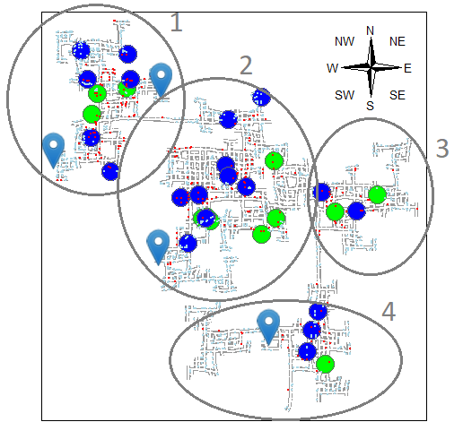

```{r setup, include=FALSE}
knitr::opts_chunk$set(echo = TRUE,
                      eval = TRUE,
                      warning = FALSE,
                      message = FALSE,
                      fig.retina = 3) #default is 1
```
# 1. The Task

We are required to attempt bullet point 1 and 2 of Challenge 2 of [VAST Challenge 2022](https://vast-challenge.github.io/2022/) which is:

**1) Assuming the volunteers are representative of the city’s population, characterize the distinct areas of the city that you identify. For each area you identify, provide your rationale and supporting data. Limit your response to 10 images and 500 words.**

**2) Where are the busiest areas in Engagement? Are there traffic bottlenecks that should be addressed? Explain your rationale. Limit your response to 10 images and 500 words.**


# 2. The Preparation

### 2.1 Importing the relevant packages and data

The following packages within the code chunk below is install and load onto RStudio.

```{r}
packages = c('tidyverse', 'tmap', 'sf',
             'lubridate','clock',
             'sftime','rmarkdown','data.table')

for (p in packages){
  if(!require(p, character.only = T)){
    install.packages(p)
  }
  library(p,character.only = T)
}
```

# 3. Bullet Point 1

### 3.1 Importing Data 

We are using the data from the [VAST Challenge 2022](https://vast-challenge.github.io/2022/). We will use all the 6 datasets on the various entities in the city for this exercise. They are `School.csv` , `Pubs.csv` , `Apartments.csv` , `Employer.csv` , `Buildings.csv` and `Restaurants.csv` from the **Attributes** folder.


```{r}
schools <- read_sf("data/wkt/Schools.csv", 
                   options = "GEOM_POSSIBLE_NAMES=location")

pubs <- read_sf("data/wkt/Pubs.csv", 
                   options = "GEOM_POSSIBLE_NAMES=location")

apartments <- read_sf("data/wkt/Apartments.csv", 
                   options = "GEOM_POSSIBLE_NAMES=location")

buildings <- read_sf("data/wkt/Buildings.csv", 
                   options = "GEOM_POSSIBLE_NAMES=location")

employers <- read_sf("data/wkt/Employers.csv", 
                   options = "GEOM_POSSIBLE_NAMES=location")

restaurants <- read_sf("data/wkt/Restaurants.csv", 
                   options = "GEOM_POSSIBLE_NAMES=location")
```

### 3.2 The City Map

We then use the various function under the `'tmap'` package to understand the location of each entity in respect to each other within the city. 

```{r}
city_map <- tm_shape(buildings)+
tm_polygons(col = "grey60",
           size = 1,
           border.col = "white",
           border.lwd = 1) +
tm_shape(pubs) +
  tm_bubbles(col = "green") +
tm_shape(restaurants) +
  tm_bubbles(col = "blue") +
tm_shape(apartments) +
  tm_dots(col = "lightblue") +
tm_shape(employers) +
  tm_dots(col = "red") +
tm_shape(schools) +
  tm_markers(col = "yellow") 
 
```

We plot a static map with a compass to add in description of the locality of the entities.

```{r,include=FALSE}
tmap_mode("plot")
city_map +
tm_compass(type="4star", position=c("right", "top"), show.labels = 3)
```


We then plot an interactive map to enable us to explore the city at ease.

```{r}
tmap_mode("view")
city_map 
 
```

### 3.3 Observations

1. **Overall All**. The entities seems to cluster around 4 main regions in the Engagement city. Region 1 - a mid sized area up North-West region, Region 2 - the biggest area right at the heart of the city central, Region 3 & 4 - two smaller areas at the Eastern and South-East region.

2. **Schools.** The 4 schools are spread out; noting that Region 1 has two schools within but Region 3 has no school. 

3. **Employers**. They are concentrated at Region 1 and 2, with more restaurants and pubs in these regions as well. 

4. **Residential Areas.** The apartments are cluttered area schools.


# 4. Bullet Point 2

### 4.1 About the Data

About 1000 representative residents have volunteered to provide data using the city’s urban planning app, which records the places they visit, their spending, and their purchases, among other things; in particular, the **Activity Logs** dataset recorded the status of each participant in 5-minute increments over the duration of the 15-month data collection period.

### 4.2 Importing Data 

For this section, due to large dataset, we will use one **Activity Log** - `ParticipantStatusLogs6.csv` to see the traffic pattern on weekday and weekend.   

```{r,eval=FALSE}
logs <- read_sf("data/ParticipantStatusLogs6.csv", 
                options = "GEOM_POSSIBLE_NAMES=currentLocation")
```

We then processed the data and split to it between weekday and weekend traffic using `filter()`. 

```{r,eval=FALSE}

logs1 <- logs[,-c(5:12)]

logs1 <- logs1 %>%
  mutate(Timestamp = date_time_parse(timestamp,
                zone = "",
                format = "%Y-%m-%dT%H:%M:%S")) %>%
  mutate(Day = wday(Timestamp)) %>%
  filter(currentMode == "Transport")

 write_rds(logs1, "data/logs1.rds")

```

```{r}
 logs1 <- read_rds("data/logs1.rds")

logs_WkDay<- logs1 %>%
  filter(Day == "1" |Day == "2"|Day == "3"|Day == "4"|Day == "5")

logs_WkEnd<- logs1 %>%
  filter(Day == "6" |Day == "7")
```

### 4.3 The Hexagon Binning Map

In the code chunk below, `st_make_grid()` of sf package is used to create hexagons

```{r}
hex <- st_make_grid(buildings, 
                    cellsize=100, 
                    square=FALSE) %>%
  st_sf() %>%
  rowid_to_column('hex_id')

```

The code chunk below perform point in polygon overlay by using `[st_join()]` of sf package and used to count the number of event points in the hexagons. 

```{r}
points_in_hex_WkDay <- st_join(logs_WkDay, 
                        hex, 
                        join=st_within) %>%
  st_set_geometry(NULL) %>%
  count(name='pointCount', hex_id)

#left-join using hex as the target table and points_in_hex as the join table with join ID as hex_id.
hex_WkDay <- hex %>%
  merge(points_in_hex_WkDay, 
            by = 'hex_id') %>%
  replace(is.na(.), 0)

#`tmap` package is used to create the hexagon binning map.
tmap_mode("view")
tm_shape(hex_WkDay %>%
           filter(pointCount > 0))+
  tm_fill("pointCount",
          n = 8,
          style = "quantile") +
  tm_borders(alpha = 0.1)

```

We then repeat the steps for weekend traffic. 

```{r}
points_in_hex_WkEnd <- st_join(logs_WkEnd, 
                        hex, 
                        join=st_within) %>%
  st_set_geometry(NULL) %>%
  count(name='pointCount', hex_id)

hex_WkEnd <- hex %>%
  merge(points_in_hex_WkEnd, 
            by = 'hex_id') %>%
  replace(is.na(.), 0)

tmap_mode("view")
tm_shape(hex_WkEnd %>%
           filter(pointCount > 0))+
  tm_fill("pointCount",
          n = 8,
          style = "quantile") +
  tm_borders(alpha = 0.1)
```

### 4.4 Observations

1. **Overall All**. It seems to be not much difference between the traffic (i.e. check in) between weekday and weeknight. We see that increase traffic along the connecting roads between each region.

2. **Higher Activity**. We see that Region 1 and 2 has more activities going on than the other 2 regions. 

### 4.5 Futher Exploration

We further explored the traffic for **weekday** peak hours i.e. 7-9am, 3-5pm (as per start and end work time) and non peak hours (mid day period) to see if there are any bottle neck to address. 

```{r}
logs_WkDay_Peak <- logs_WkDay %>%
        mutate(Peak = (hour(Timestamp) <= 9 & hour(Timestamp) >= 6 | hour(Timestamp) <= 18 & hour(Timestamp) >= 15)) %>%     filter(Peak == "TRUE")

logs_WkDay_NonPeak<- logs_WkDay %>%
        mutate(NonPeak = hour(Timestamp) < 15 & hour(Timestamp) > 9) %>%
        filter(NonPeak == "TRUE")
```

We look at weekday non peak and added schools, employers onto the map. 

```{r}
points_in_hex_WkDayNP <- st_join(logs_WkDay_NonPeak, 
                        hex, 
                        join=st_within) %>%
  st_set_geometry(NULL) %>%
  count(name='pointCount', hex_id)

hex_WkDayNP <- hex %>%
  merge(points_in_hex_WkDayNP, 
            by = 'hex_id') %>%
  replace(is.na(.), 0)

tmap_mode("view")
tm_shape(hex_WkDayNP %>%
           filter(pointCount > 0))+
  tm_fill("pointCount",
          n = 8,
          style = "quantile") +
  tm_borders(alpha = 0.1)+
  tm_shape(schools) +
  tm_markers(col = "yellow") +
  tm_shape(employers) +
  tm_dots(col = "green", alpha =0.2) 
```

We then look at weekday peak. 

```{r}
points_in_hex_WkDayP <- st_join(logs_WkDay_Peak, 
                        hex, 
                        join=st_within) %>%
  st_set_geometry(NULL) %>%
  count(name='pointCount', hex_id)

hex_WkDayP <- hex %>%
  merge(points_in_hex_WkDayP, 
            by = 'hex_id') %>%
  replace(is.na(.), 0)

tmap_mode("view")
tm_shape(hex_WkDayP %>%
           filter(pointCount > 0))+
  tm_fill("pointCount",
          n = 8,
          style = "quantile") +
  tm_borders(alpha = 0.1)+
  tm_shape(schools) +
  tm_markers(col = "yellow") +
  tm_shape(employers) +
  tm_dots(col = "green", alpha =0.2) 
```

### 4.6 Observations

1. **Overall All**. We could immediately see that peak hours has more activities than non peak hours.  

2. **High Activity**.We see an increased traffic along the connecting roads between each region during peak hours than non peak hours especially between region 3 and 4. 

